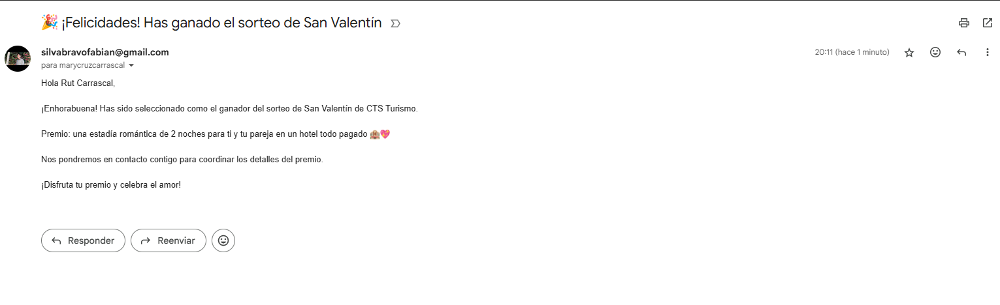

# CTS Turismo – Prueba Técnica

Aplicación Full Stack para gestionar un sorteo de San Valentín. El premio es una estadía de 2 noches todo pagado para una pareja en un hotel. La aplicación permite registrar participantes, verificar correos, activar cuentas y seleccionar al azar un ganador.

## Registro de participantes

Los usuarios pueden registrarse proporcionando su nombre, correo y teléfono.


## Panel de administración

Desde el panel, el administrador puede:

- Listar participantes verificados
- Filtrar por estado
- Seleccionar ganador aleatorio
- Revisar último ganador


## Ganador del sorteo

El sistema guarda y muestra automáticamente al último ganador.




## Tecnologías

- Backend: Python 3.x, Django 5.2, Django REST Framework
- Tareas asíncronas: Celery + Redis
- Frontend: Vue.js
- Base de datos: SQLite (desarrollo)
- Correo electrónico: Gmail SMTP (con App Password)

## Instalación y ejecución

1. Clonar repositorio
   git clone <https://github.com/fabisb/Prueba-tecnica-CTS>
   cd Prueba-tecnica-CTS

2. Crear entorno virtual
   python -m venv .venv
   source .venv/bin/activate # Linux/macOS
   .venv\Scripts\activate # Windows
   pip install -r requirements.txt

3. Configurar variables de entorno en `.env` o `settings.py`

✉ Configuración SMTP Gmail

Crea un archivo `.env` en la raíz del proyecto y agrega las siguientes variables:

EMAIL_HOST=smtp.gmail.com
EMAIL_PORT=587
EMAIL_USE_TLS=True
EMAIL_HOST_USER=tu_correo@gmail.com
EMAIL_HOST_PASSWORD=tu_app_password
DEFAULT_FROM_EMAIL=tu_correo@gmail.com
FRONTEND_URL=http://localhost:5173

> Reemplaza `tu_correo@gmail.com` y `tu_app_password` por tu correo real y la App Password de Gmail.  
> Asegúrate de que tu backend lea estas variables desde `.env` usando `django-environ` o la configuración de tu `settings.py`.

4. Levantar Redis (Docker para facilitar compatibilidad con Windows)
   docker run -d --name redis -p 6379:6379 redis:7

5. Migrar base de datos
   python manage.py migrate

6. Ejecutar aplicación (3 terminales distintos)

- Django: `python manage.py runserver`
- Celery (Windows): `celery -A cts_turismo_backend worker --loglevel=info --pool=solo` (Salir de la terminar y crear otra en caso de que no cargue)
> En Linux/macOS no es necesario `--pool=solo`.
- Frontend: `cd frontend && npm install && npm run dev`

7. Crear superusuario (admin)
   python manage.py createsuperuser

>Ingresa email, nombre de usuario y contraseña. Este será el administrador del concurso.


## Flujo del concurso

1. Inscripción del usuario (nombre, email, teléfono)
2. Validación de duplicados por email
3. Envío de correo con enlace de verificación
4. Creación de contraseña tras verificar el correo
5. Confirmación de participación
6. Selección de ganador aleatorio por admin
7. Notificación automática al ganador vía email

## Decisiones técnicas

- Celery + Redis para envío asíncrono de correos
- Django REST Framework para endpoints claros y manejo de serialización
- Email único como `USERNAME_FIELD` para evitar registros duplicados
- Contraseñas encriptadas, rutas protegidas para admin y token único de verificación
- En Windows, Celery usa `--pool=solo` para evitar errores de multiprocessing

## Endpoints principales

### Registro de participante
**URL:** `POST /api/users/registrar/`  
**Descripción:** Permite registrar un nuevo participante para el sorteo.  
**Request body:**
```json
{
  "first_name": "Juan",
  "last_name": "Pérez",
  "email": "juan@example.com",
  "phone": "1234567890"
}
```
Response:
```json
{"message":"¡Gracias por registrarte! Revisa tu correo para verificar tu cuenta."}
```
Verificación de correo
GET /api/users/verify-email/<token>/ → 
```json
{"message":"Token válido. Ingresa tu nueva contraseña."}
```
```json
POST /api/users/verify-email/<token>/ → 
{"password":"nuevaClave"} → {"message":"Tu cuenta ha sido activada. Ya estás participando en el sorteo."}
```
Admin login/logout/session
POST /api/users/admin/login/ → 
```json
{"token":"<token>"}
```
POST /api/users/admin/logout/ → 
```json
{"message":"Logout exitoso"}
```
GET /api/users/admin/session/ → 
```json
{"is_authenticated":true,"username":"admin"}
```
Participantes (admin)
GET /api/users/admin/participants/?is_verified=true → 
```json
lista de participantes con id, first_name, last_name, email, is_verified
```
Ganador (admin)

POST /api/users/admin/participants/draw_winner/ → 
```json
{"winner":{"id":3,"first_name":"Ana","last_name":"Gómez","email":"ana@example.com"}}
```
GET /api/users/admin/last-winner/ → 
```json
{"winner":{"id":3,"first_name":"Ana","last_name":"Gómez","email":"ana@example.com","date_won":"2025-09-30T20:15:00Z"}}
```


## Nota

Este proyecto está pensado para desarrollo local.
Para producción, configurar HTTPS y dominios confiables (CSRF_TRUSTED_ORIGINS y CORS_ALLOWED_ORIGINS).
